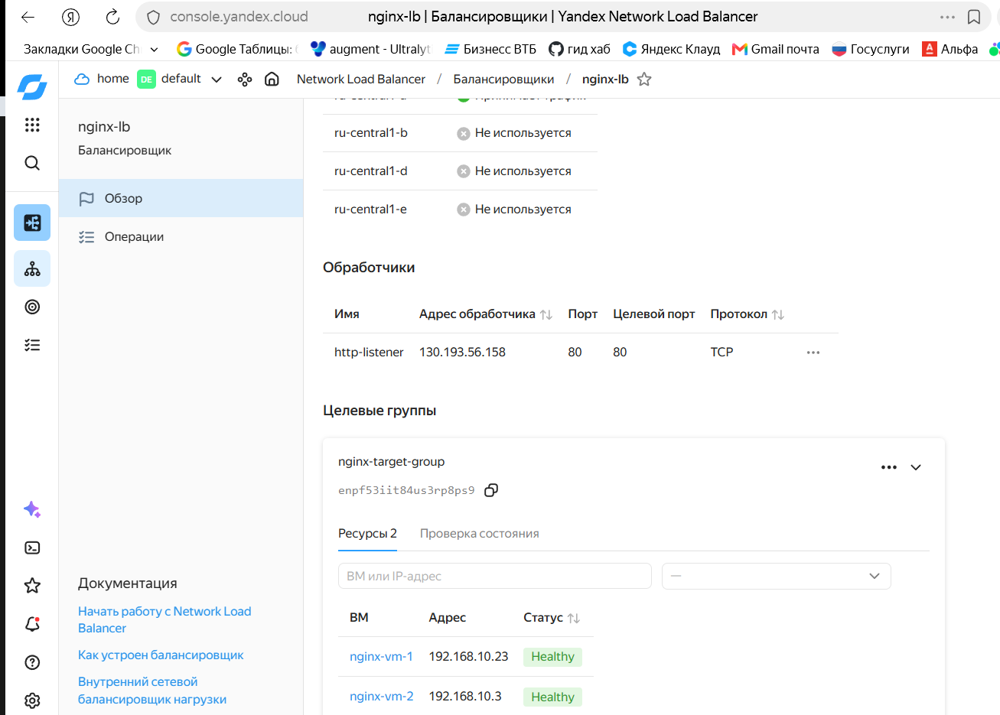
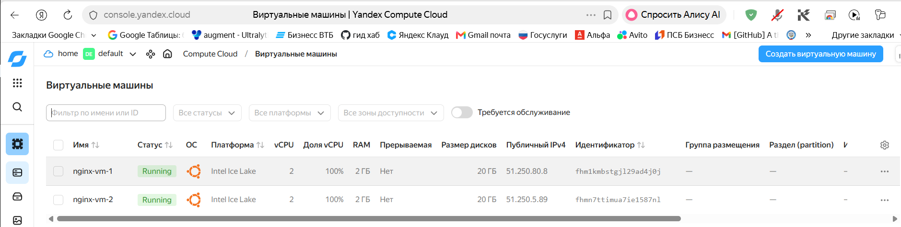
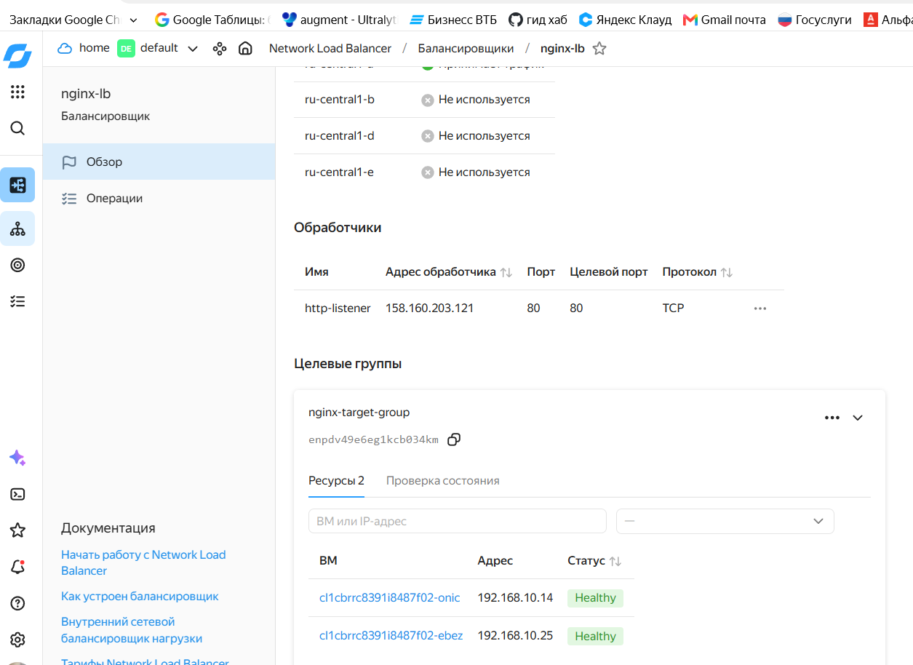

# Домашнее задание: Отказоустойчивость в облаке

**Выполнил:** Санакин А.В.

---

## Задание 1

Создано через Terraform:
- 2 виртуальные машины `nginx-vm-1` и `nginx-vm-2` через `count`
- Таргет-группа `nginx-target-group`
- Сетевой балансировщик `nginx-lb`

Nginx установлен вручную через SSH.

### Результаты

**Балансировщик:** `nginx-lb`, IP `130.193.56.158`, статус **Active**

**Целевая группа:** `nginx-target-group`, 2 цели **Healthy**

### Скриншоты

---

## Задание 2*

Создано через Terraform:
- Группа виртуальных машин `nginx-instance-group`
- Автоматическая установка Nginx через `cloud-init` (user-data)
- Таргет-группа и балансировщик автоматически

### Результаты

**Балансировщик:** `nginx-lb`, IP `158.160.203.121`, статус **Active**

**Целевая группа:** `nginx-target-group`, 2 цели **Healthy**

### Скриншоты

